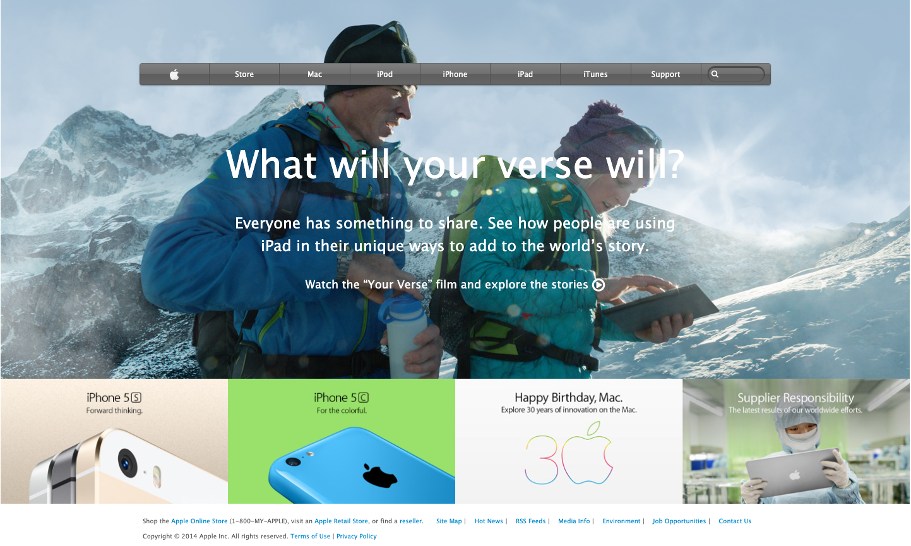

# Old Apple Site Clone

> In this project I clone a old version of an apple webpage using the power of CSS and it's gradients, and background properties

## Built With

- HTML
- CSS

## Live Demo

[Live Demo Link](https://rawcdn.githack.com/emasdev/apple-template/d245abe48f94fdef777a03872e0b3abd4bf2f021/index.html)

## Getting Started

### Prerequisites

- A web browser that can read HTML and CSS

## Authors

👤 **Emanuel**

- Github: [@githubhandle](https://github.com/emasdev)

## 🤝 Contributing

Contributions, issues and feature requests are welcome!

Feel free to check the [issues page](issues/).

## Show your support

Give a ⭐️ if you like this project!

## Acknowledgments

- Hat tip to anyone whose code was used
- Inspiration
- etc

## 📝 License

This project is [MIT](lic.url) licensed.
